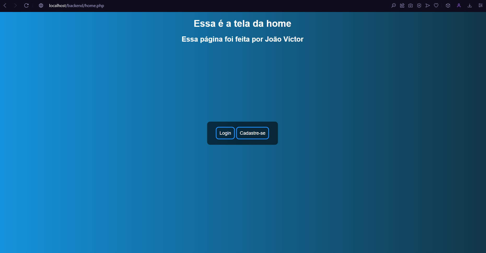
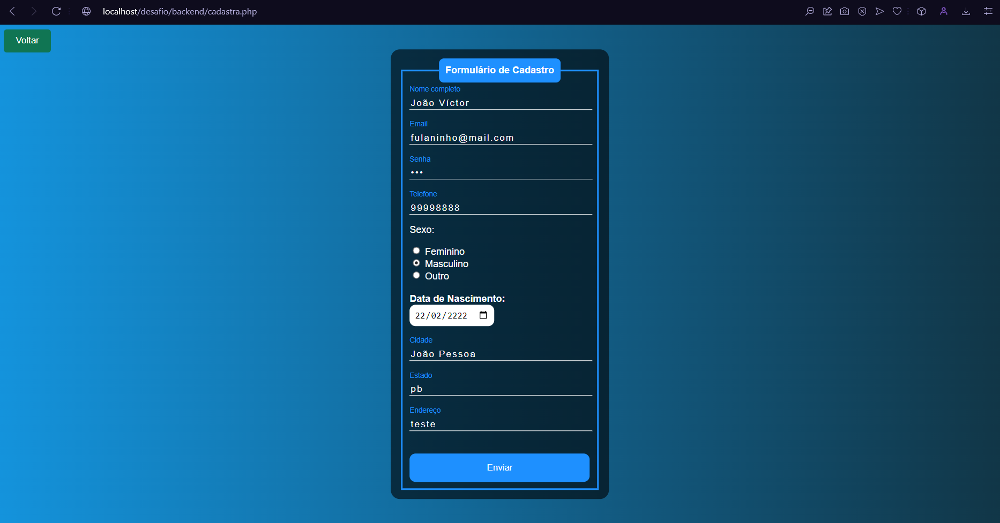
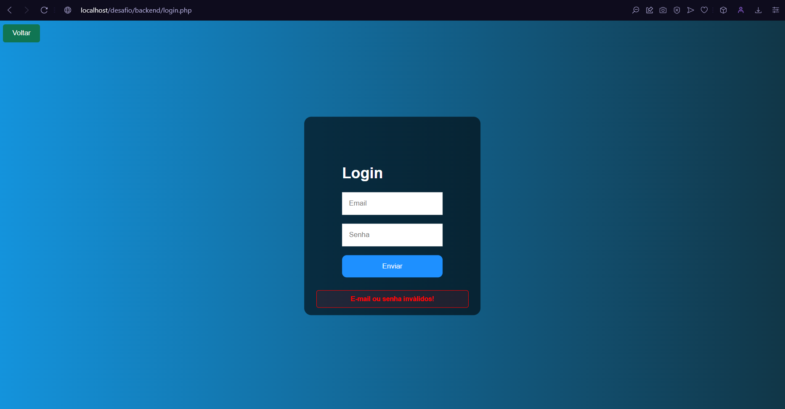
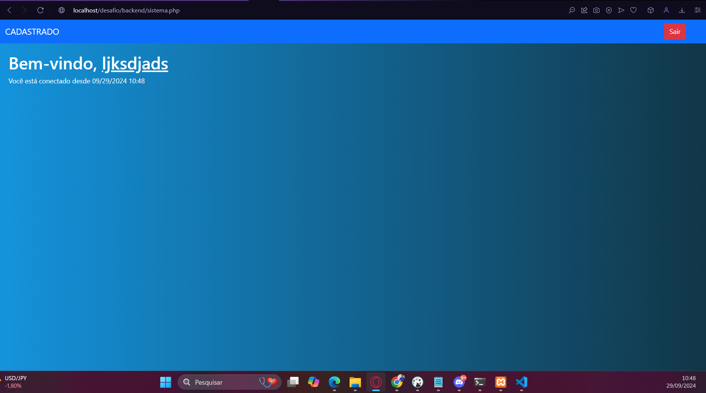

# Tela de Login/Cadastro
Esse projeto consiste em realizar uma tela de **login/cadastro** simples, utilizando as tecnologias: **HTML, CSS, JavaScript, Bootstrap, PHP e PostgreSQL** como Banco de dados Relacional. Utilizei um sistema de criptografia simples para a senha do usuário não ser cadastrada no banco como uma String simples, mas sim como um **Hash** encriptografado. Os usuários logados serão armazenados em sessões, podendo navegar livremente pelas páginas disponíveis da aplicação, já os usuários que não estão logados, não poderão entrar na tela do sistema sem antes realizar o login com credenciais válidas.

## Como rodar a aplicação
1. Abra o terminal e execute o seguinte comando: `git clone https://github.com/jvmaiaa/desafio_backennd_php.git`
2. Execute o seu servidor apache localmente. Recomendo o uso do **XAMPP** pela simplicidade de uso e instalação.
3. Possua o PostgreSQL instalado na sua máquina, crie um banco de dados chamado `joao` com o comando `CREATE DATABASE joao;` e crie uma tabela chamada `usuarios` executando o seguinte script:
```
CREATE TABLE usuarios (
	id SERIAL NOT NULL PRIMARY KEY,
	nome VARCHAR(45) NOT NULL,
	email VARCHAR(110) NOT NULL,
	telefone VARCHAR(15) NOT NULL,
	sexo VARCHAR(15) NOT NULL,
	data_nasc DATE NOT NULL, 
	cidade VARCHAR(45) NOT NULL,
	estado VARCHAR(45) NOT NULL,
	endereco VARCHAR(45) NOT NULL
);
```
4. vá até o arquivo que está localizado em `backend/database/connection.php` e troque as minhas credenciais pelas credenciais do Banco que está instalado na sua máquina. 
5. Através de um navegador, acesse a seguinte URL: `localhost/desafio_backend_php/backend/home.php`
6. A partir daí você pode realizar a navegação iterativa.

## Tela Home
-> A partir dessa tela você pode escolher se quer realizar a navegação para **login** ou para **cadastro**.


## Tela de Cadastro
-> A partir desse endpoint, você pode tentar realizar o cadastro de um novo usuário. O endpoint necessário é o seguinte: `localhost/desafio_backend_php/backend/cadastra.php`

- Se o cadastro for realizado com sucesso, você será redirecionado para a tela de login para inserir as credenciais que acabou de cadastrar.

- Caso o E-mail já estiver cadastrado, o usuário irá receber um alerta, informando que o e-mail é inválido.
## Tela de Login
-> Nessa tela você pode tentar inserir credenciais que foram cadastradas com sucesso na tela anterior. O endpoint pode ser acessado através da URL: `localhost/desafio_backend_php/backend/login.php`. Após a inserir o login e a senha, a aplicação irá passar por um arquivo chamado `valida-login.php` que será responsável por toda a lógica de validação das credenciais fornecidas pelo usuário.
- Caso as credenciais estejam incorretas, o usuário receberá o seguinte alerta:

- Caso as credenciais estejam corretas, o usuário irá acessar a tela do sistema e iniciar uma sessão, a partir do endpoint: `localhost/desafio_backend_php/backend/sistema.php`, desejando uma mensagem de boas-vindas informando o mesmo nome do usuário na hora do cadastro e informando desde quando o usuário iniciou a sessão.

**OBS: O navegador pode ser fechado e aberto novamente, e continuará com a sessão ativa. Para cancelar a sessão basta apertar no botão `sair`**